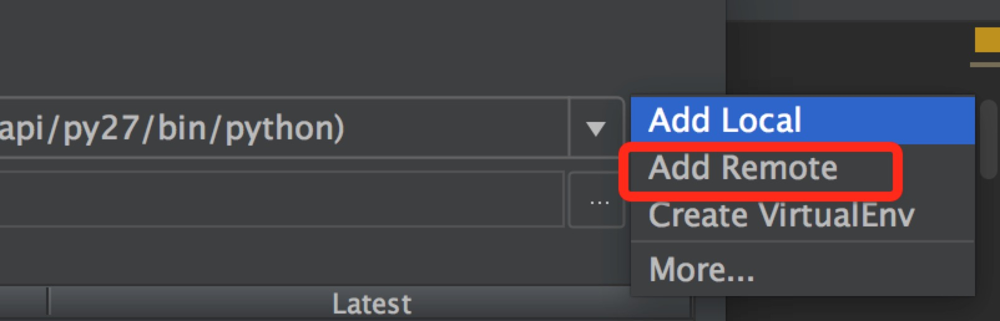

# Python测试环境远端调试配置

### 工具

PyCharm <Professional Edition>

### 配置方法 

1. Pycharm -> Preferences -> Project:<hotel-i> -> Project Interpreter

2. Project Interpreter这一栏最右边有个设置按钮


3. 选择 Add Remote



4. 配置ssh,以及选择对应的python路径 -> ok

	- 服务端使用的是virtualenv, ``Project interpreter path``需要设置为 <Project>/env/bin/python

5. 配置 Path mappings 映射服务器该项目的目录路径 -> ok

6. Edit Configurations 选择 Python interpreter 为 ```xxx(ssh://root@xxx.xxx.xx.xxx:22/home/stsr/hot)```


